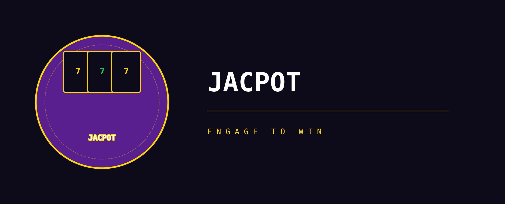

# 🎰 Welcome to JACPOT

> **Stake. Engage. Win.**

**JACPOT** is a next-generation decentralized protocol that combines **gamified tokenomics**, a **provably fair jackpot system**, and a revolutionary **Luck Staking** engine to create the most engaging DeFi experience ever built.

Unlike traditional yield farming or reflection tokens, JACPOT rewards **consistent engagement** — not passive holding. The longer you stake, the more you engage, and the higher your **Luck Score** grows — directly multiplying your odds of winning the ever-growing jackpot.

---

## 🌟 Key Features

| Feature | Description |
| --- | --- |
| 🎲 **Two-Tier Daily Draws** | 25 guaranteed Small Win winners every day + a conditional Jackpot draw — all via Chainlink VRF |
| 🍀 **Luck Staking** | Stake tokens to earn Luck — a non-transferable score that multiplies your raffle odds |
| 🗡️ **Daily Missions** | Complete on-chain tasks daily to earn Luck Shards and Mystery Crates |
| 🎁 **Mystery Crates** | Daily claimable rewards with tiered rarity — from Luck Shards to USDC micro-rewards |
| 🎟️ **Raffle Tickets** | Simple on-chain entries that put you in the draw — no complexity, just buy and play |
| 🌡️ **Pressure Mode** | Low volume? The pot keeps growing until it explodes in a Mega Draw |
| 🏦 **Smart Treasury** | On-chain DeFi yield funds the ecosystem sustainably |
| 📣 **Hype Vault** | Self-healing marketing fund that activates during slow periods |

---

## 💡 The Core Philosophy

**"Don't pay people to hold. Reward people for engaging."**

Most DeFi protocols suffer from the same problem: they emit tokens to attract users, creating inflation that eventually kills the project. JACPOT takes a fundamentally different approach:

* **No token emissions** — Staking doesn't mint new tokens
* **No inflationary rewards** — You earn Luck (probability), not money
* **Real revenue** — Jackpots are funded by trading tax; staker rewards and operations are funded by ticket sales and treasury yield
* **Engagement > Holding** — Active participants have exponentially better odds than passive holders
* **Daily winners** — 25 people win prizes every single day and share on X to claim

---

## 🚀 Quick Links

* [Overview →](introduction/overview.md)
* [Tokenomics →](tokenomics/token-overview.md)
* [How Luck Staking Works →](core-mechanics/luck-staking.md)
* [Jackpot System →](core-mechanics/jackpot-system.md)
* [Roadmap →](roadmap.md)
* [FAQ →](faq.md)

---

> 📌 **Disclaimer:** This documentation is for informational purposes only. Please review the [Risks & Disclaimers](risks-and-disclaimers.md) section before participating.
