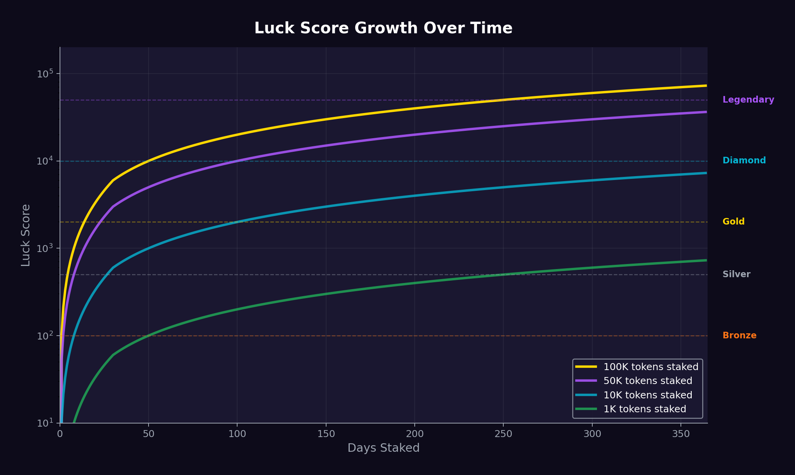
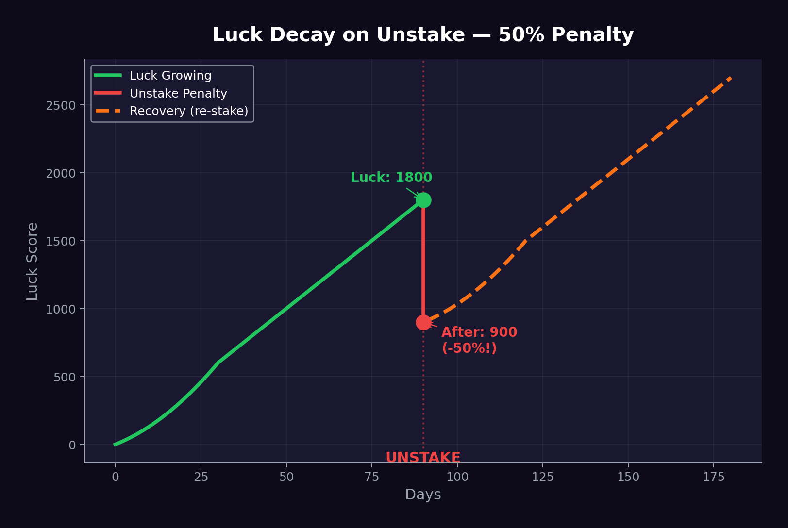

# Luck Staking

## The Big Idea

**Luck Staking** is JACPOT's core innovation. It's a fundamentally new staking model where:

- You **don't** earn more tokens
- You **don't** earn USDC yield
- You **earn Luck** — a non-transferable, non-tradeable on-chain score
- Luck **directly multiplies your odds** in every raffle draw

> "Stake to increase your probability of winning, not to earn passive income."

This is **not a giveaway**. Luck is access to probability. The actual prizes come from the revenue-funded jackpot.

## How Luck Works



### The Luck Formula

```
Luck Score = (Tokens Staked × Days Staked × Streak Multiplier) + Luck Shards
```

| Component | Description | Effect |
| --- | --- | --- |
| **Tokens Staked** | Number of JACPOT tokens in the staking contract | Linear multiplier — 2x tokens = 2x base Luck |
| **Days Staked** | Consecutive days tokens have been staked | Compounding — Luck grows faster over time |
| **Streak Multiplier** | Consecutive days of claiming daily Mystery Crate | Up to 2x multiplier at 30-day streak |
| **Luck Shards** | Earned from Daily Missions and Mystery Crates | Additive bonus on top of base Luck |

### Luck Accumulation Example

| Day | Tokens Staked | Days | Streak | Shards | Luck Score |
| --- | --- | --- | --- | --- | --- |
| 1 | 10,000 | 1 | 1.0x | 0 | 10,000 |
| 7 | 10,000 | 7 | 1.1x | 15 | 77,015 |
| 30 | 10,000 | 30 | 1.5x | 90 | 450,090 |
| 90 | 10,000 | 90 | 2.0x | 300 | 1,800,300 |
| 365 | 10,000 | 365 | 2.0x | 1,200 | 7,301,200 |

> A user who has staked for 365 days has **730x more Luck** than a Day 1 staker with the same tokens. **Loyalty is massively rewarded.**

## Luck Decay



This is the mechanism that makes Luck Staking sticky and prevents mercenary behavior.

### Unstaking Penalty

| Action | Luck Consequence |
| --- | --- |
| **Unstake any amount** | 50% of total Luck Score is **instantly destroyed** |
| **Sell tokens** | Luck proportional to sold tokens is removed + 25% penalty on remaining |
| **Miss daily claim** | Streak resets to 1.0x (Luck Score itself is preserved) |
| **Inactive for 30+ days** | Luck begins decaying at 1% per day |

### Why Luck Decay Matters

Imagine you've staked for 6 months and accumulated 2,000,000 Luck:

- **If you unstake:** Your Luck drops to 1,000,000 instantly
- **To rebuild:** You'd need to stake for another ~3 months to recover
- **The cost of leaving is enormous** — not in money, but in accumulated advantage

> This creates a powerful psychological lock-in. Users think twice before unstaking because they're not just losing tokens — they're losing months of accumulated probability.

## Luck Tiers

As your Luck Score grows, you unlock tiers with escalating benefits:

| Tier | Luck Required | Raffle Multiplier | Benefits |
| --- | --- | --- | --- |
| — **No Tier** | 0 | 1.0x | Base odds only |
| 🥉 **Bronze** | 100 | 1.2x | Access to daily missions |
| 🥈 **Silver** | 500 | 1.5x | + Weekly Mini Draw eligibility |
| 🥇 **Gold** | 2,000 | 2.0x | + Priority Mystery Crate (better drop rates) |
| 💎 **Diamond** | 10,000 | 3.0x | + Monthly Mega Draw bonus entry + Governance voting |
| 👑 **Legendary** | 50,000 | 5.0x | + Custom NFT badge + Hall of Fame + Exclusive quarterly draw |

### Tier Benefits Breakdown

#### 🥉 Bronze (100 Luck)
- Unlocks Daily Missions (earn Luck Shards)
- Basic Mystery Crate access
- 1.2x raffle odds multiplier

#### 🥈 Silver (500 Luck)
- Everything in Bronze +
- Eligible for **Wednesday Mini Draws** (smaller pot, fewer participants = better odds)
- Improved Mystery Crate drop rates
- 1.5x raffle odds multiplier

#### 🥇 Gold (2,000 Luck)
- Everything in Silver +
- **Priority Mystery Crate** — higher chance of Epic and Legendary drops
- Access to exclusive Gold-tier community channels
- 2.0x raffle odds multiplier

#### 💎 Diamond (10,000 Luck)
- Everything in Gold +
- **Bonus entry** in Monthly Mega Draws (free)
- **Governance voting** rights on treasury deployment and protocol parameters
- Diamond badge displayed on leaderboard
- 3.0x raffle odds multiplier

#### 👑 Legendary (50,000 Luck)
- Everything in Diamond +
- **Custom NFT badge** — unique, soulbound, displayed across the ecosystem
- **Hall of Fame** — permanent recognition on the JACPOT website
- **Exclusive Quarterly Draw** — only Legendary tier participants, separate pot
- Priority access to new features and partnerships
- 5.0x raffle odds multiplier

## Staking Mechanics

### How to Stake
1. Connect wallet to JACPOT dApp
2. Approve JACPOT token spending
3. Select amount to stake
4. Confirm transaction
5. Luck accumulation begins immediately

### How to Unstake
1. Navigate to Staking dashboard
2. Select amount to unstake
3. **Warning displayed:** "Unstaking will reduce your Luck Score by 50%"
4. Confirm with acknowledgment
5. Tokens returned to wallet
6. Luck Score reduced immediately

### Partial Unstaking
- You can unstake a portion of your tokens
- Luck penalty is still 50% of **total** Luck Score (not proportional)
- This prevents gaming through gradual unstaking

## Leaderboard

A public leaderboard displays:
- Top 100 Luck Scores (wallet addresses)
- Current tier distribution (how many users at each tier)
- Average Luck Score across all stakers
- Total tokens staked protocol-wide

> The leaderboard creates **social competition** and motivates users to climb tiers.

## Technical Implementation

- Luck Score is stored **on-chain** in the staking contract
- Luck is **non-transferable** — it cannot be sent, sold, or delegated
- Luck is **non-tokenized** — it is a mapping in the contract, not an ERC-20
- Luck calculations are performed at **snapshot time** for gas efficiency
- Historical Luck data is indexed via subgraph for UI display
