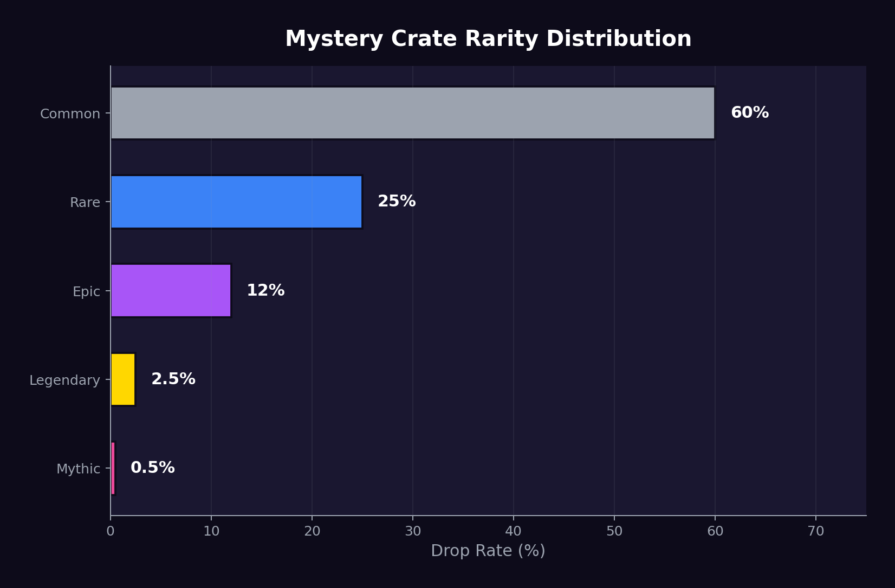
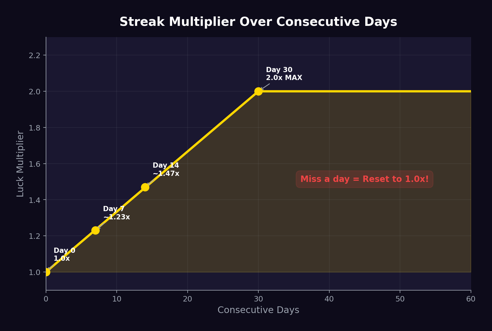

# Micro-Loot System

## Overview

The Micro-Loot System is JACPOT's daily engagement engine. It gives every staker a reason to return to the protocol **every single day** through missions, mystery crates, and streak rewards.

> No free giveaways. Everything is earned through engagement.

## Daily Missions

Every day at 00:00 UTC, three missions are generated for each staker. Missions are simple on-chain verifiable actions:

### Mission Types

| Mission | Action Required | Reward | Verification |
| --- | --- | --- | --- |
| 🛡️ **Hold Mission** | Hold your staked position for 24h without unstaking | 1 Luck Shard | Contract state check |
| ⚡ **Engage Mission** | Perform any protocol interaction (buy pass, claim crate, vote) | 1 Luck Shard | Transaction verification |
| 🤝 **Social Mission** | Refer a new wallet that stakes or buys a pass | 2 Luck Shards | Referral contract |
| 💧 **LP Mission** | Provide liquidity above threshold | 3 Luck Shards | LP position check |
| 🎯 **Bonus Mission** | Random special task (changes daily) | 2-5 Luck Shards | Varies |

### Mission Rules

- Each user receives **exactly 3 missions per day** (randomly selected from the pool)
- Missions reset at **00:00 UTC**
- Uncompleted missions **expire** — no carryover
- Mission completion is verified **on-chain** — no honor system
- You must be a **Bronze tier or above** staker to access missions

### Mission Completion Flow

```
00:00 UTC → 3 Missions Generated
    │
    ├── Complete Mission 1 → +1 Luck Shard
    ├── Complete Mission 2 → +1 Luck Shard  
    └── Complete Mission 3 → +2 Luck Shards
    │
    ▼
All 3 Complete? → "Perfect Day" Bonus → +2 Extra Luck Shards
    │
    ▼
23:59 UTC → Missions Expire
```

> Completing all 3 missions in a day grants a **"Perfect Day" bonus** of 2 extra Luck Shards.

## Mystery Crates



Mystery Crates are daily claimable reward boxes available to all stakers.

### How to Claim

1. Must have tokens staked (any amount)
2. Navigate to the Micro-Loot section of the dApp
3. Click "Open Crate" (one per day)
4. Pay a small gas fee (the crate itself is free for stakers)
5. Chainlink VRF determines the contents
6. Reward is delivered instantly

### Crate Drop Rates

| Rarity | Probability | Contents |
| --- | --- | --- |
| 🟢 **Common** | 60% | 1 Luck Shard |
| 🔵 **Rare** | 25% | 3 Luck Shards |
| 🟣 **Epic** | 12% | 1 Free Common Raffle Pass |
| 🟡 **Legendary** | 2.5% | Micro-USDC reward ($1-$5 from treasury yield) |
| 🔴 **Mythic** | 0.5% | 10 Luck Shards + 1 Free Rare Raffle Pass |

### Priority Crates (Gold+ Tier)

Stakers at Gold tier and above receive **Priority Mystery Crates** with improved drop rates:

| Rarity | Standard Rate | Priority Rate |
| --- | --- | --- |
| 🟢 Common | 60% | 40% |
| 🔵 Rare | 25% | 30% |
| 🟣 Epic | 12% | 20% |
| 🟡 Legendary | 2.5% | 8% |
| 🔴 Mythic | 0.5% | 2% |

> Priority Crates are a **major incentive** to reach Gold tier through consistent staking.

## Streak System



The Streak System rewards **consecutive daily engagement**.

### How Streaks Work

- Claim your Mystery Crate on consecutive days to build a streak
- Your streak number increases by 1 each day you claim
- Missing a day **resets your streak to 0**

### Streak Multiplier

Your streak directly multiplies your Luck accumulation rate:

| Streak Days | Multiplier | Effect |
| --- | --- | --- |
| 0-6 | 1.0x | Base rate |
| 7-13 | 1.1x | 10% faster Luck accumulation |
| 14-20 | 1.2x | 20% faster |
| 21-29 | 1.5x | 50% faster |
| 30+ | 2.0x | **Double** Luck accumulation (maximum) |

### Streak Milestones

Special one-time rewards at streak milestones:

| Milestone | Reward |
| --- | --- |
| 7-day streak | 5 bonus Luck Shards |
| 30-day streak | 1 Free Epic Raffle Pass |
| 90-day streak | "Dedicated" NFT badge (soulbound) |
| 180-day streak | 1 Free Legendary Raffle Pass |
| 365-day streak | "OG Believer" NFT badge + permanent 2.5x Luck multiplier |

> The 365-day streak reward is **extremely powerful** — a permanent 2.5x multiplier that stacks with the 2.0x streak multiplier for a total of **5.0x** Luck accumulation rate.

## Luck Shards

Luck Shards are the micro-currency of the engagement system.

### Properties

| Property | Value |
| --- | --- |
| **Transferable** | No |
| **Tradeable** | No |
| **Expirable** | No — once earned, they're permanent |
| **Tokenized** | No — stored as a contract mapping |
| **Purpose** | Additive bonus to Luck Score |

### Earning Luck Shards

| Source | Shards per Day (Typical) |
| --- | --- |
| Daily Missions (3/3 complete) | 4-8 shards |
| Perfect Day Bonus | 2 shards |
| Mystery Crate | 1-10 shards |
| Streak Milestones | 5 shards (one-time) |
| Community Quests | Varies |

**Estimated daily earnings for an active user: 7-20 Luck Shards**

### Shards vs. Base Luck

Luck Shards are **additive**, not multiplicative. They provide a meaningful boost for smaller stakers but don't overshadow the compounding effect of large, long-term stakes:

```
Total Luck = (Base Luck from Staking) + (Total Luck Shards)
```

A user with 10,000 tokens staked for 90 days has ~1,800,000 base Luck. Their 300 accumulated shards add 300 — meaningful but not dominant. This ensures that **staking remains the primary driver** while missions provide supplementary engagement.

## Funding Source

All Micro-Loot rewards are funded sustainably:

| Reward Type | Funded By |
| --- | --- |
| Luck Shards | No cost — they're on-chain score points |
| Free Raffle Passes | Protocol mints them (no USDC cost, just entry allocation) |
| USDC micro-rewards | Treasury DeFi yield |

> **Zero token emissions.** The Micro-Loot System costs the protocol almost nothing to operate while driving massive daily engagement.
