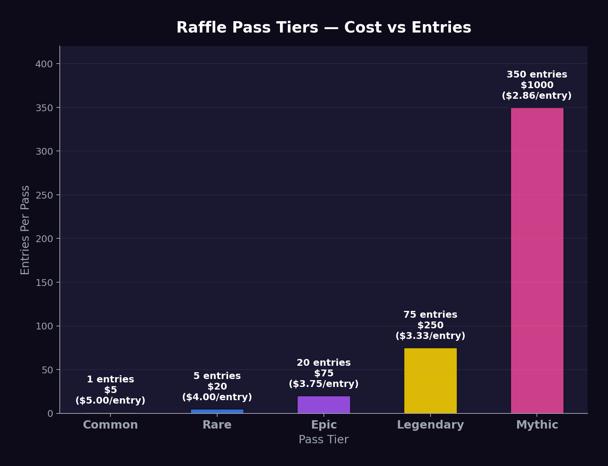

# Raffle Passes

## What Are Raffle Passes?

Raffle Passes are **NFT-based entries** into the JACPOT jackpot draws. Each pass represents one entry into the raffle, with your odds further multiplied by your Luck Score.

Raffle Passes are:
- ✅ **Purchasable** with USDC
- ✅ **NFTs** (ERC-1155) with visual art and rarity tiers
- ✅ **Consumable** — burned after the draw they're entered into
- ✅ **Tradeable** on secondary NFT markets before the draw
- ❌ **Not securities** — they are one-time raffle entries, not yield-bearing instruments

## Rarity Tiers



Raffle Passes come in **five rarity tiers**, each with different entry multipliers:

| Tier | Price (USDC) | Entries per Pass | Visual |
| --- | --- | --- | --- |
| 🟢 **Common** | $5 | 1 entry | Basic design |
| 🔵 **Rare** | $20 | 5 entries | Animated border |
| 🟣 **Epic** | $75 | 20 entries | Holographic effect |
| 🟡 **Legendary** | $250 | 75 entries | Full animation + sound |
| 🔴 **Mythic** | $1,000 | 350 entries | Unique 1-of-1 art + guaranteed Mini Draw entry |

> Higher tiers offer a **slight discount per entry** compared to buying multiple Common passes, incentivizing larger purchases.

### Entry Value Comparison

| Tier | Price | Entries | Cost per Entry |
| --- | --- | --- | --- |
| Common | $5 | 1 | $5.00 |
| Rare | $20 | 5 | $4.00 |
| Epic | $75 | 20 | $3.75 |
| Legendary | $250 | 75 | $3.33 |
| Mythic | $1,000 | 350 | $2.86 |

## How to Get Raffle Passes

### 1. Purchase (Primary)
Buy directly from the JACPOT dApp using USDC. Passes are minted on purchase.

### 2. Mystery Crates (Free)
Epic-tier Mystery Crates have a 12% chance of containing a free Common Raffle Pass.

### 3. Community Quests (Earned)
Completing collective community goals can reward participants with bonus passes.

### 4. Secondary Market (Traded)
Buy from other users on NFT marketplaces before the draw deadline.

## Revenue Distribution from Pass Sales

| Allocation | Percentage | Purpose |
| --- | --- | --- |
| **Jackpot Pot** | 90% | Directly grows the prize pool |
| **LP & Buyback** | 10% | Buys back JACPOT and adds to liquidity pool |

## Pass Lifecycle

```
Mint/Purchase → Hold (tradeable) → Draw Snapshot → 
Draw Executed → Pass Burned (consumed)
```

1. **Minted** when purchased or earned
2. **Active** until the next draw — can be traded on secondary markets
3. **Snapshotted** at draw time — ownership locked
4. **Burned** after the draw — win or lose, the pass is consumed
5. **New passes** must be purchased for the next draw

> This creates a **recurring revenue model** — users must buy new passes for each draw cycle.

## Pass Validity

- Passes are valid for **one draw cycle** (typically one week)
- Unused passes from a missed draw are **automatically entered** into the next available draw
- Passes cannot be refunded after purchase
- Passes purchased after the snapshot deadline are entered into the following draw

## Collectibility

While passes are consumed after draws, the **art and metadata** are preserved:
- Winners receive a special **"Winner's Trophy" NFT** commemorating their win
- Mythic passes that don't win receive a **"Mythic Participant" badge** (soulbound)
- All pass art is generated procedurally with unique traits
