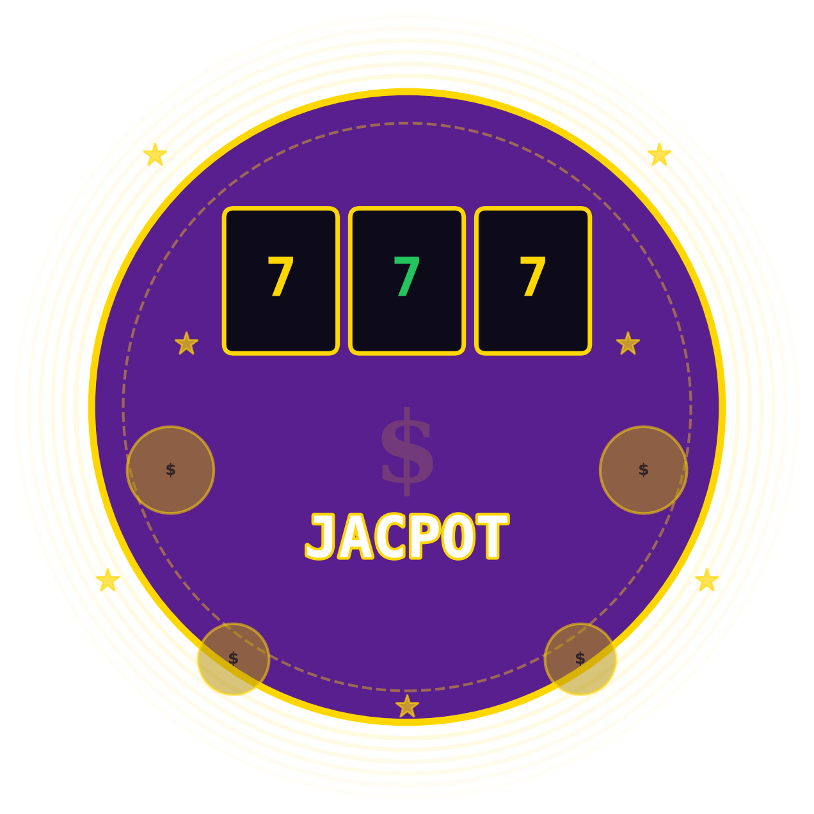

# Overview



## What is JACPOT?

**JACPOT** is the first **Engage-to-Win** decentralized protocol built on Base. It combines a gamified jackpot system, revolutionary Luck Staking mechanics, and a sustainable treasury model to create a DeFi experience where **active participation is directly rewarded with better odds of winning real prizes**.

At its core, JACPOT is built around one simple idea:

> **The more you engage, the luckier you get.**

## How It Works (30-Second Summary)

1. **Buy the token** — A 5% tax on every buy and sell is collected in USDC and flows into the **Jackpot Pot**.
2. **Stake your tokens** — Staking earns you **Luck**, a non-transferable on-chain score that multiplies your raffle odds.
3. **Engage daily** — Complete missions and claim Mystery Crates to earn **Luck Shards** that further boost your score.
4. **Buy Raffle Passes** — NFT-based tickets that enter you into the jackpot draw.
5. **Win the Jackpot** — Drawn via Chainlink VRF (provably fair). Your Luck Score multiplies your chances.
6. **Repeat** — The pot refills, your Luck compounds, and the cycle continues.

## What Makes JACPOT Different?

| Traditional DeFi | JACPOT |
| --- | --- |
| Stake tokens → earn more tokens (inflation) | Stake tokens → earn Luck (probability, zero inflation) |
| Passive holding rewarded | Active engagement rewarded |
| Rewards funded by emissions | Rewards funded by real revenue (tax + treasury yield) |
| No reason to return daily | Daily missions, crates, and streaks create habit loops |
| Low volume = project dies | Low volume = Pressure Mode builds bigger jackpots |

## The Ecosystem at a Glance

```
JACPOT Ecosystem
├── Token (ERC-20 with 5/5% tax)
│   └── Tax collected in USDC → Jackpot Pot
├── Luck Staking Engine
│   ├── Stake tokens → accumulate Luck
│   ├── Luck Decay on unstake/sell
│   └── Luck Tiers (Bronze → Legendary)
├── Jackpot System
│   ├── Raffle Passes (NFTs)
│   ├── Chainlink VRF draws
│   └── Pressure Mode (low volume accumulation)
├── Micro-Loot System
│   ├── Daily Missions
│   ├── Mystery Crates
│   └── Luck Shards
├── Treasury
│   ├── On-chain DeFi yield
│   ├── Hype Vault (marketing fund)
│   └── Drought Bonuses
└── Community
    ├── Seasonal Events
    ├── Community Quests
    └── Leaderboards
```

## Target Audience

- **DeFi enthusiasts** looking for something beyond yield farming
- **Gamers and gamblers** who enjoy provably fair on-chain games
- **Long-term holders** who want their loyalty to translate into tangible advantages
- **Community-driven investors** who value engagement over speculation
