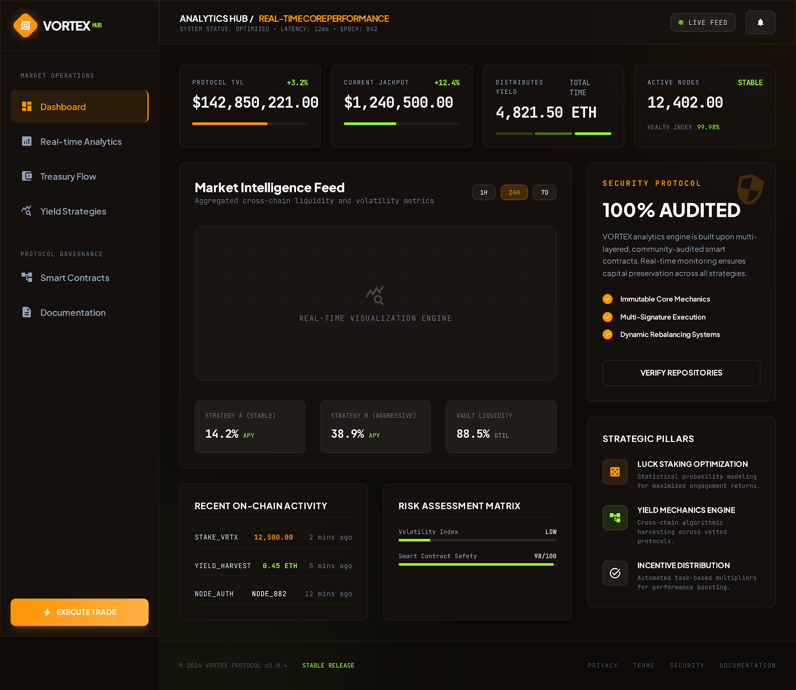

# Overview

<figure><figcaption><p>VORTEX Dashboard — Real-time Protocol Metrics</p></figcaption></figure>


## What is VORTEX?

**VORTEX** is the first **Engage-to-Win** decentralized protocol built on Base. It combines a gamified vortex system, revolutionary Luck Staking mechanics, and a sustainable treasury model to create a DeFi experience where **active participation is directly rewarded with better odds of winning real prizes**.

At its core, VORTEX is built around one simple idea:

> **The more you engage, the luckier you get.**

## How It Works (30-Second Summary)

1. **Buy the token** — A 5% tax on every buy and sell is collected in USDC — 4% flows into the **Vortex Pot** and 1% goes to the **Team**.
2. **Stake your tokens** — Staking earns you **Luck**, a non-transferable on-chain score that multiplies your raffle odds.
3. **Engage daily** — Complete missions and claim Mystery Crates to earn **Luck Shards** that further boost your score.
4. **Buy raffle tickets** — Simple on-chain entries purchased with USDC that put you in the daily draws.
5. **Win daily** — Every day, 25 Small Win winners are selected. If the vortex threshold is met, a main Vortex winner is drawn too — all via Chainlink VRF.
6. **Share to claim** — Small Win winners share their win on X (Twitter) to claim their prize, creating organic viral marketing.
7. **Repeat** — The pot refills daily, your Luck compounds, and the cycle continues.

## What Makes VORTEX Different?

| Traditional DeFi | VORTEX |
| --- | --- |
| Stake tokens → earn more tokens (inflation) | Stake tokens → earn Luck (probability, zero inflation) |
| Passive holding rewarded | Active engagement rewarded |
| Rewards funded by emissions | Rewards funded by real revenue (tax + treasury yield) |
| No reason to return daily | Daily missions, crates, streaks, and 25 daily winners create habit loops |
| Low volume = project dies | Low volume = Pressure Mode builds bigger vortexs |
| Weekly or monthly draws | **Daily draws** — 25 winners every single day |

## The Ecosystem at a Glance

```
VORTEX Ecosystem
├── Token (ERC-20 with 5/5% tax)
│   └── Tax collected in USDC → 4% Vortex Pot, 1% Team
├── Luck Staking Engine
│   ├── Stake tokens → accumulate Luck
│   ├── Luck Decay on unstake/sell
│   └── Luck Tiers (Bronze → Legendary)
├── Two-Tier Daily Draw System
│   ├── 25 Daily Small Wins (share on X to claim)
│   ├── Conditional Vortex Draw
│   ├── Chainlink VRF (provably fair)
│   └── Pressure Mode (low volume accumulation)
├── Micro-Loot System
│   ├── Daily Missions
│   ├── Mystery Crates
│   └── Luck Shards
├── Treasury (funded by ticket sales)
│   ├── On-chain DeFi yield
│   ├── Staker USDC rewards
│   ├── Hype Vault (marketing fund)
│   └── Drought Bonuses
└── Community
    ├── Seasonal Events
    ├── Community Quests
    └── Leaderboards
```

## Target Audience

- **DeFi enthusiasts** looking for something beyond yield farming
- **Gamers and gamblers** who enjoy provably fair on-chain games
- **Long-term holders** who want their loyalty to translate into tangible advantages
- **Community-driven investors** who value engagement over speculation
