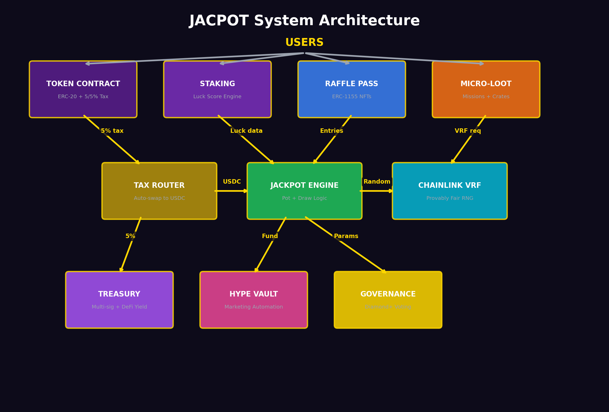

# Smart Contract Architecture

## Overview



The JACPOT protocol consists of **six core smart contracts** that interact to form the complete ecosystem. All contracts are designed with security, transparency, and immutability as primary goals.

## Contract Map

```
┌─────────────────────────────────────────────────────────────┐
│                   JACPOT CONTRACTS                   │
├─────────────────────────────────────────────────────────────┤
│                                                              │
│  ┌──────────────┐    ┌──────────────┐    ┌──────────────┐   │
│  │   TOKEN       │    │   STAKING    │    │   JACKPOT    │   │
│  │   CONTRACT    │◄──►│   CONTRACT   │    │   CONTRACT   │   │
│  │              │    │              │    │              │   │
│  │ • ERC-20     │    │ • Luck Score │    │ • Pot mgmt   │   │
│  │ • 5/5% tax (4/1 split) │────►│ • Decay      │    │ • Draw logic │   │
│  │ • Max wallet │    │ • Tiers      │◄──►│ • Payouts    │   │
│  │ • Max tx     │    │ • Streaks    │    │ • Rollover   │   │
│  └──────┬───────┘    └──────────────┘    └──────┬───────┘   │
│         │                                        │           │
│         │ Tax (USDC)                    VRF      │           │
│         ▼                              Request   ▼           │
│  ┌──────────────┐    ┌──────────────┐    ┌──────────────┐   │
│  │   TAX        │    │   RAFFLE     │    │   CHAINLINK  │   │
│  │   ROUTER     │    │   PASS       │    │   VRF        │   │
│  │              │    │   CONTRACT   │    │   CONSUMER   │   │
│  │ • Swap to    │    │              │    │              │   │
│  │   USDC       │    │ • ERC-1155   │    │ • Random     │   │
│  │ • Route to   │────►│ • Mint/Burn  │◄──►│   number     │   │
│  │   Jackpot    │    │ • Tiers      │    │ • Callback   │   │
│  └──────────────┘    │ • Pricing    │    │ • Verifiable │   │
│                      └──────────────┘    └──────────────┘   │
│                                                              │
│  ┌──────────────────────────────────────────────────────┐   │
│  │                    TREASURY                           │   │
│  │   • Multi-sig controlled                              │   │
│  │   • DeFi yield deployment                             │   │
│  │   • Hype Vault allocation                             │   │
│  │   • Drought Bonus distribution                        │   │
│  └──────────────────────────────────────────────────────┘   │
└─────────────────────────────────────────────────────────────┘
```

## Contract Details

### 1. Token Contract

| Property | Detail |
| --- | --- |
| **Standard** | ERC-20 (with custom tax logic) |
| **Language** | Solidity ^0.8.x |
| **Key Features** | Buy/sell tax, max wallet, max transaction, exemption list |
| **Upgradeable** | No — immutable after deployment |
| **Admin Functions** | None post-renouncement |

**Core Functions:**

```solidity
// Simplified interface
interface IProjectToken {
    function transfer(address to, uint256 amount) external returns (bool);
    function approve(address spender, uint256 amount) external returns (bool);
    // Tax is applied automatically on DEX buys/sells
    // Wallet-to-wallet transfers are tax-free
}
```

**Tax Logic:**
- On buy/sell via DEX: 5% of transaction value is intercepted
- Intercepted tokens are swapped to USDC via DEX router
- USDC is forwarded to the Jackpot Contract
- Swap occurs when accumulated tax tokens exceed a threshold (gas optimization)

### 2. Staking Contract

| Property | Detail |
| --- | --- |
| **Standard** | Custom (non-standard) |
| **Key Features** | Luck Score tracking, decay logic, tier calculation, streak tracking |
| **Upgradeable** | Proxy pattern for Luck formula adjustments (governance-controlled) |
| **State** | Mapping of address → StakeInfo struct |

**Core Data Structure:**

```solidity
struct StakeInfo {
    uint256 amountStaked;      // Tokens currently staked
    uint256 stakeTimestamp;    // When staking began
    uint256 luckScore;         // Current accumulated Luck
    uint256 luckShards;        // Accumulated shards from missions/crates
    uint256 streakDays;        // Current consecutive claim streak
    uint256 lastClaimTime;     // Last daily crate claim timestamp
    uint8   currentTier;       // Bronze(1) to Legendary(5)
}
```

**Key Functions:**

```solidity
interface IStaking {
    function stake(uint256 amount) external;
    function unstake(uint256 amount) external;  // Triggers 50% Luck decay
    function claimDailyCrate() external;         // Daily Mystery Crate
    function completeMission(uint8 missionId) external;
    function getLuckScore(address user) external view returns (uint256);
    function getTier(address user) external view returns (uint8);
    function getStreakMultiplier(address user) external view returns (uint256);
}
```

**Luck Calculation (at snapshot time):**

```solidity
function calculateLuck(address user) public view returns (uint256) {
    StakeInfo memory info = stakes[user];
    uint256 daysStaked = (block.timestamp - info.stakeTimestamp) / 1 days;
    uint256 streakMult = getStreakMultiplier(user); // 100-200 (1.0x-2.0x)

    uint256 baseLuck = info.amountStaked * daysStaked * streakMult / 100;
    return baseLuck + info.luckShards;
}
```

### 3. Jackpot Contract

| Property | Detail |
| --- | --- |
| **Standard** | Custom |
| **Key Features** | Pot management, draw scheduling, payout logic, Pressure Mode |
| **Upgradeable** | No — immutable |
| **Admin Functions** | Emergency pause only (multi-sig) |

**Core Functions:**

```solidity
interface IJackpot {
    function deposit(uint256 usdcAmount) external;        // Receive tax/pass revenue
    function triggerDraw() external;                       // Permissionless after schedule
    function claimPrize(uint256 drawId) external;          // Winner claims
    function getPotBalance() external view returns (uint256);
    function isInPressureMode() external view returns (bool);
    function getDrawSchedule() external view returns (uint256 nextDraw);
}
```

**Draw Execution Flow:**

```
triggerDraw() called (permissionless, after scheduled time)
    │
    ├── Check: Is Pressure Mode active? → If yes, revert
    ├── Check: Is it past scheduled draw time? → If no, revert
    │
    ▼
Snapshot all valid Raffle Passes
    │
    ▼
Weight each pass by holder's Luck Score
    │
    ▼
Request random number from Chainlink VRF
    │
    ▼
[VRF Callback] → fulfillRandomWords()
    │
    ▼
Select weighted random winner
    │
    ▼
Distribute pot:
    ├── 50% → Winner
    ├── 35% → Rollover (stays in pot)
    ├── 10% → LP & Buyback contract
    └── 5%  → Treasury
    │
    ▼
Burn all entered Raffle Passes
    │
    ▼
Emit DrawCompleted event
```

### 4. Raffle Pass Contract

| Property | Detail |
| --- | --- |
| **Standard** | ERC-1155 (multi-token) |
| **Key Features** | Tiered minting, pricing, burn-on-draw, metadata |
| **Upgradeable** | No |

**Token IDs by Tier:**

| Token ID | Tier | Price | Entries |
| --- | --- | --- | --- |
| 1 | Common | $5 | 1 |
| 2 | Rare | $20 | 5 |
| 3 | Epic | $75 | 20 |
| 4 | Legendary | $250 | 75 |
| 5 | Mythic | $1,000 | 350 |

**Core Functions:**

```solidity
interface IRafflePass {
    function purchase(uint8 tier, uint256 quantity) external; // Pay USDC, receive raffle entry
    function burnForDraw(address holder, uint256 tokenId) external; // Called by Jackpot
    function getEntries(uint8 tier) external pure returns (uint256);
}
```

### 5. Chainlink VRF Consumer

| Property | Detail |
| --- | --- |
| **Standard** | VRFConsumerBaseV2Plus |
| **Key Features** | Random number requests, callback handling, request tracking |
| **Network** | Base Chainlink VRF V2.5 |

**Integration:**

```solidity
contract VRFConsumer is VRFConsumerBaseV2Plus {
    // Called by Jackpot Contract to request randomness
    function requestRandomWinner(uint256 drawId) external onlyJackpot {
        uint256 requestId = s_vrfCoordinator.requestRandomWords(
            VRFV2PlusClient.RandomWordsRequest({
                keyHash: keyHash,
                subId: subscriptionId,
                requestConfirmations: 3,
                callbackGasLimit: 500000,
                numWords: 1,
                extraArgs: "" 
            })
        );
        drawRequests[requestId] = drawId;
    }

    // Chainlink calls back with the random number
    function fulfillRandomWords(uint256 requestId, uint256[] calldata randomWords) 
        internal override 
    {
        uint256 drawId = drawRequests[requestId];
        IJackpot(jackpotContract).completeDraw(drawId, randomWords[0]);
    }
}
```

### 6. Treasury (Multi-Sig)

| Property | Detail |
| --- | --- |
| **Type** | Gnosis Safe multi-sig |
| **Signers** | 3-of-5 configuration |
| **Key Features** | DeFi deployment, Hype Vault management, Drought Bonus distribution |

The Treasury is not a custom smart contract but a **Gnosis Safe** multi-sig wallet that interacts with external DeFi protocols. Automated functions (Drought Bonuses, Hype Vault deployment) are handled by **Chainlink Automation** (Keepers) with parameters set by governance.

## Contract Interaction Diagram

```
User Actions:

[Buy Token] ──► Token Contract ──► Tax Router ──► Jackpot (USDC)
[Sell Token] ──► Token Contract ──► Tax Router ──► Jackpot (USDC)
[Stake] ──────► Staking Contract ──► Luck Score Updated
[Unstake] ────► Staking Contract ──► 50% Luck Decay Applied
[Buy Pass] ───► Raffle Pass Contract ──► 90% Jackpot / 10% LP
[Claim Crate] ► Staking Contract ──► VRF Consumer ──► Crate Result
[Trigger Draw] ► Jackpot Contract ──► VRF Consumer ──► Winner Selected
```

## Deployment Plan

| Phase | Contracts | Network |
| --- | --- | --- |
| **Testnet Alpha** | All contracts | Base Testnet |
| **Testnet Beta** | All contracts + VRF integration | Base Testnet |
| **Audit** | All contracts submitted for audit | — |
| **Mainnet Launch** | All contracts deployed | Base Mainnet |
| **Renouncement** | Token contract ownership renounced | Base Mainnet |

## Gas Optimization

| Optimization | Implementation |
| --- | --- |
| **Batched tax swaps** | Tax tokens accumulated and swapped in batches to reduce gas |
| **Lazy Luck calculation** | Luck Score computed at snapshot time, not on every block |
| **ERC-1155 for passes** | Multi-token standard reduces gas vs. separate ERC-721s |
| **Minimal storage writes** | Streak and mission data packed into single storage slots |
