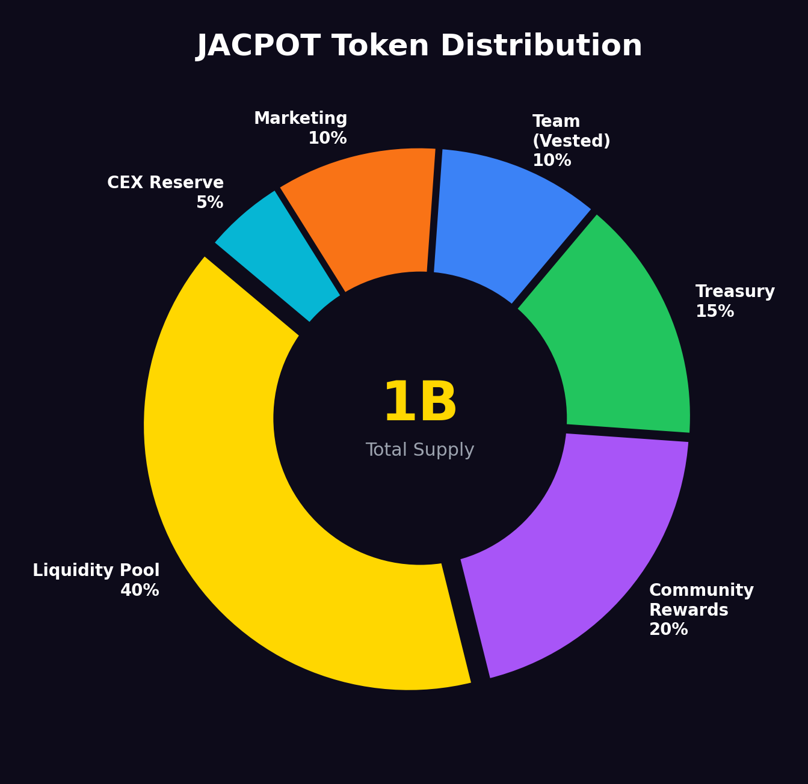

# Supply & Distribution

## Total Supply

**1,000,000,000 JACPOT** — Fixed supply. No minting function. No inflation.

## Allocation



| Allocation | Percentage | Amount | Vesting |
| --- | --- | --- | --- |
| **Public Sale / Launch** | 40% | TBD | Immediate |
| **Liquidity Pool** | 25% | TBD | Locked 12 months, then protocol-owned |
| **Treasury** | 15% | TBD | 6-month cliff, 24-month linear vest |
| **Team** | 10% | TBD | 12-month cliff, 36-month linear vest |
| **Marketing & Partnerships** | 5% | TBD | 3-month cliff, 12-month linear vest |
| **Ecosystem Rewards** | 5% | TBD | Reserved for future integrations |

## Vesting Details

### Team Tokens (10%)
- **12-month cliff** — No team tokens unlock for the first year
- **36-month linear vest** — After cliff, tokens unlock linearly over 3 years
- **Vesting contract** — Publicly verifiable on-chain
- **No early unlock** — Smart contract enforced, no admin override

### Treasury (15%)
- Managed by multi-sig wallet (3-of-5 signers)
- Used for: protocol development, DeFi yield deployment, emergency reserves
- All treasury movements visible on-chain

### Liquidity Pool (25%)
- Paired with USDC on Uniswap
- LP tokens **locked for 12 months** via Unicrypt
- After lock period, LP becomes **protocol-owned liquidity** (never removed)

## Deflationary Mechanics

While JACPOT has a fixed supply (no burn mechanism by default), the effective circulating supply decreases over time through:

1. **Staking lockup** — Tokens staked for Luck are removed from circulation
2. **LP growth** — 10% of raffle pass sales buy back JACPOT and add to LP
3. **Lost wallets** — Natural attrition of inactive wallets

## Supply Visualization

```
Total Supply: 1,000,000,000

┌──────────────────────────────────────────────────┐
│ Public Sale (40%)          ████████████████████   │
│ Liquidity Pool (25%)       ████████████▌          │
│ Treasury (15%)             ███████▌               │
│ Team (10%)                 █████                  │
│ Marketing (5%)             ██▌                    │
│ Ecosystem (5%)             ██▌                    │
└──────────────────────────────────────────────────┘
```

> All allocation addresses will be published and verifiable on-chain at launch.
