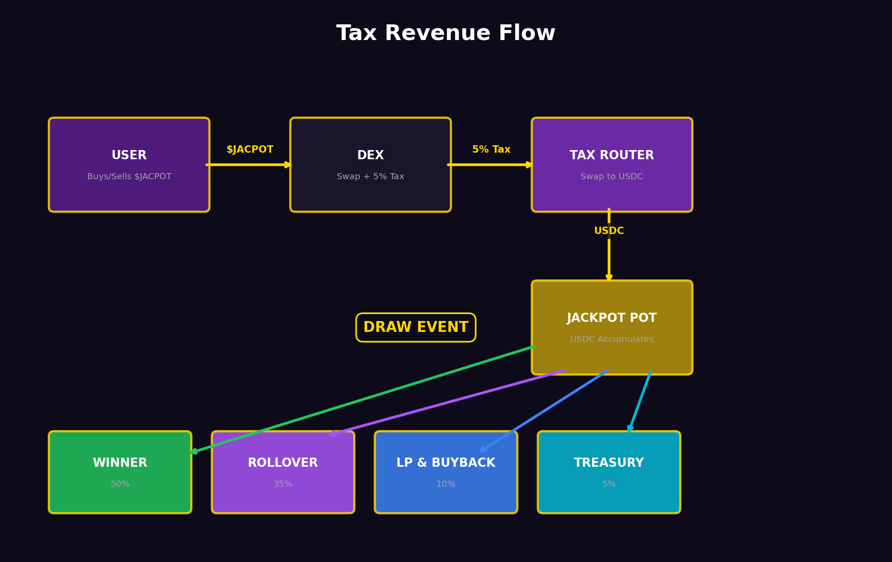

# Tax Mechanics

## How Tax Collection Works

### Buy Tax (5%)
When a user buys JACPOT on a DEX:
1. The swap is executed through the JACPOT smart contract
2. 5% of the transaction value is calculated
3. This 5% is automatically swapped to **USDC** via the DEX router
4. The USDC is sent to the **Jackpot Contract**
5. The user receives 95% of the expected tokens

### Sell Tax (5%)
When a user sells JACPOT on a DEX:
1. The user initiates a sell of X tokens
2. 5% of the tokens are intercepted by the contract
3. These tokens are swapped to **USDC** via the DEX router
4. The USDC is sent to the **Jackpot Contract**
5. The remaining 95% of tokens are sold as normal

### Transfer Tax (0%)
Wallet-to-wallet transfers are **tax-free**. This allows:
- Moving tokens between personal wallets
- Sending tokens to friends
- Interacting with the staking contract without tax

## Tax Flow Diagram



```
User Buys JACPOT          User Sells JACPOT
       │                            │
       ▼                            ▼
   5% Tax (USDC)              5% Tax (USDC)
       │                            │
       └────────────┬───────────────┘
                    │
                    ▼
            Jackpot Contract
                    │
                    ▼
            Jackpot Pot Grows
                    │
                    ▼
            Next Raffle Draw
```

## Anti-Gaming Measures

| Measure | Purpose |
| --- | --- |
| **Minimum transaction size** | Prevents dust attacks that clog the swap mechanism |
| **Swap threshold** | Tax USDC is batched and swapped when accumulated amount hits threshold (reduces gas) |
| **Blacklist for contracts** | Prevents MEV bots from exploiting tax arbitrage |
| **Max wallet limit** | Prevents single wallet from accumulating excessive supply |
| **Max transaction limit** | Prevents large single trades from manipulating price |

## Tax Exemptions

The following addresses are exempt from tax:
- Staking contract
- Liquidity pool management
- Treasury operations
- Protocol-owned contracts

> Tax exemptions are hardcoded and cannot be modified post-deployment for security.
