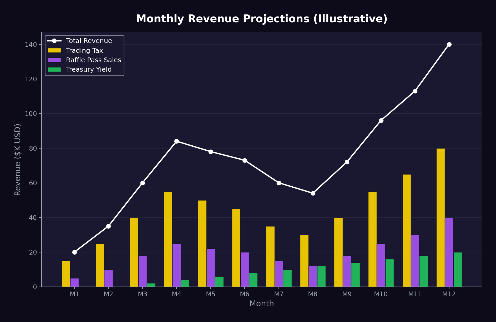

# Revenue Model

## Revenue Streams

JACPOT generates revenue from **four distinct sources**, ensuring the protocol is never dependent on a single income stream.

### Stream 1: Trading Tax

| Detail | Value |
| --- | --- |
| **Rate** | 5% buy / 5% sell |
| **Currency** | Collected in USDC |
| **Destination** | 100% to Jackpot Pot |
| **Volume Dependent** | Yes |

This is the primary revenue driver during periods of active trading.

### Stream 2: Raffle Pass Sales

| Detail | Value |
| --- | --- |
| **Pricing** | $5 - $1,000 per pass (tiered) |
| **Currency** | USDC |
| **Destination** | 90% Jackpot Pot / 10% LP & Buyback |
| **Volume Dependent** | Partially (driven by jackpot size) |

Raffle Pass revenue scales with jackpot attractiveness — bigger pots drive more pass sales.

### Stream 3: Treasury Yield

| Detail | Value |
| --- | --- |
| **Source** | DeFi protocol deployments |
| **Target APY** | 5-15% blended |
| **Currency** | Various (converted to USDC) |
| **Destination** | Crate rewards, Hype Vault, Drought Bonuses, Operations |
| **Volume Dependent** | No — this is the volume-independent safety net |

Treasury yield is the **critical stabilizer** — it generates revenue regardless of trading activity.

### Stream 4: LP Fees

| Detail | Value |
| --- | --- |
| **Source** | Protocol-owned liquidity positions |
| **Currency** | JACPOT + USDC |
| **Destination** | Compounds back into LP |
| **Volume Dependent** | Yes |

LP fees from protocol-owned liquidity compound automatically, deepening the liquidity floor over time.

## Revenue Flow Diagram

```
┌─────────────────────────────────────────────────────────┐
│                    REVENUE SOURCES                       │
├──────────┬──────────┬──────────────┬───────────────────┤
│ Buy Tax  │ Sell Tax │ Raffle Sales │ Treasury Yield    │
│ (5%)     │ (5%)     │ ($5-$1000)   │ (DeFi protocols)  │
│ USDC     │ USDC     │ USDC         │ USDC              │
└────┬─────┴────┬─────┴──────┬───────┴────────┬──────────┘
     │          │            │                │
     ▼          ▼            ▼                ▼
┌─────────────────────┐ ┌────────┐  ┌─────────────────────┐
│   JACKPOT POT       │ │LP &    │  │  ECOSYSTEM FUND     │
│   (100% of tax +    │ │Buyback │  │  (Treasury yield)   │
│    90% of passes)   │ │(10% of │  │                     │
│                     │ │passes) │  ├──────────┬──────────┤
│   ┌─────────────┐   │ └────────┘  │Crate     │Hype      │
│   │ Weekly Draw  │   │            │Rewards   │Vault     │
│   │ Mini Draw    │   │            │(40%)     │(25%)     │
│   │ Mega Draw    │   │            ├──────────┼──────────┤
│   └──────┬──────┘   │            │Drought   │Operations│
│          │          │            │Bonus     │(10%)     │
│          ▼          │            │(20%)     │          │
│   ┌─────────────┐   │            ├──────────┼──────────┤
│   │Winner: 50%  │   │            │Reserve Growth (5%)  │
│   │Rollover: 35%│   │            └─────────────────────┘
│   │LP/Buy: 10%  │   │
│   │Treasury: 5% │   │
│   └─────────────┘   │
└─────────────────────┘
```

## Revenue Projections

 (Illustrative)

The following are **hypothetical scenarios** to illustrate how the revenue model scales:

### Scenario A: Early Stage ($100K daily volume)

| Source | Daily Revenue | Monthly Revenue |
| --- | --- | --- |
| Trading Tax (10% total) | $10,000 | $300,000 |
| Raffle Pass Sales | $2,000 | $60,000 |
| Treasury Yield (on $500K) | ~$70 | ~$2,100 |
| **Total** | **$12,070** | **$362,100** |

### Scenario B: Growth Stage ($1M daily volume)

| Source | Daily Revenue | Monthly Revenue |
| --- | --- | --- |
| Trading Tax | $100,000 | $3,000,000 |
| Raffle Pass Sales | $20,000 | $600,000 |
| Treasury Yield (on $5M) | ~$700 | ~$21,000 |
| **Total** | **$120,700** | **$3,621,000** |

### Scenario C: Mature Stage ($5M daily volume)

| Source | Daily Revenue | Monthly Revenue |
| --- | --- | --- |
| Trading Tax | $500,000 | $15,000,000 |
| Raffle Pass Sales | $100,000 | $3,000,000 |
| Treasury Yield (on $25M) | ~$3,500 | ~$105,000 |
| **Total** | **$603,500** | **$18,105,000** |

> These are illustrative only. Actual revenue depends on market conditions, adoption, and trading activity.

## Sustainability Analysis

### Why This Model Is Sustainable

1. **No emissions** — Revenue funds rewards, not token printing
2. **Multiple streams** — Not dependent on any single source
3. **Treasury yield** — Provides baseline revenue even at zero volume
4. **Compounding LP** — Liquidity deepens over time, reducing slippage, attracting more volume
5. **Buyback pressure** — 10% of pass sales continuously buys JACPOT, supporting price

### Risk Factors

| Risk | Mitigation |
| --- | --- |
| Volume decline | Pressure Mode + Drought Bonuses + Hype Vault |
| DeFi yield compression | Diversified protocol deployment + RWA exposure |
| Smart contract exploit | Audits + bug bounty + insurance |
| Regulatory action | No securities, no gambling classification (see [Risks](../risks-and-disclaimers.md)) |
