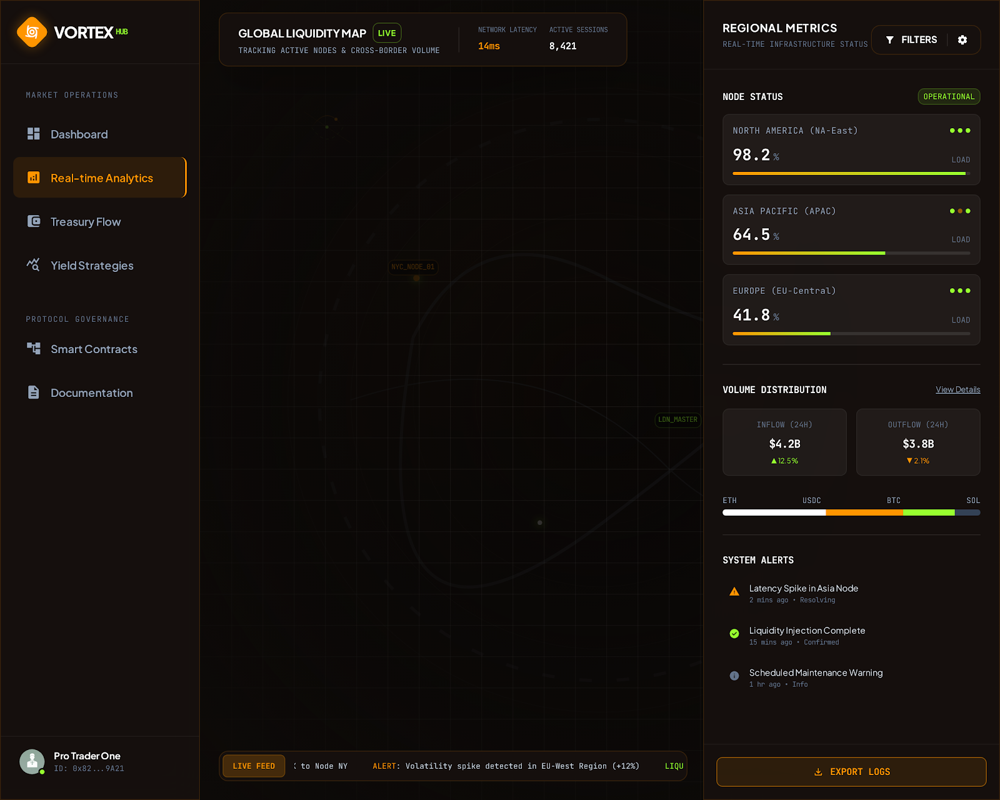

# Revenue Model

<figure><figcaption><p>Analytics Dashboard — Revenue Flow Visualization</p></figcaption></figure>


## Revenue Streams

VORTEX operates on a **dual-stream revenue model** with clear separation between the Vortex Pot and the Treasury.

### Stream 1: Trading Tax → Vortex Pot

| Detail | Value |
| --- | --- |
| **Rate** | 5% buy / 5% sell |
| **Currency** | Collected in USDC |
| **Destination** | 4% → Vortex Pot, 1% → Team |
| **Purpose** | Funds the daily vortex prize pool |

The 5% buy/sell tax on all VORTEX token trades is split: **4% flows to the Vortex Pot** and **1% goes to the Team**. This split is deployer-adjustable. The 4% portion is the primary funding source for vortex prizes.

### Stream 2: Raffle Ticket Sales → Treasury

| Detail | Value |
| --- | --- |
| **Pricing** | $5 – $1,000 per ticket (tiered) |
| **Currency** | USDC |
| **Destination** | 100% to Treasury |
| **Purpose** | Funds operations, small wins, staker rewards, and DeFi yield |

All raffle ticket revenue flows directly to the Treasury — the central hub that manages ecosystem allocations.

### Stream 3: External Revenue → Treasury

| Detail | Value |
| --- | --- |
| **Source** | DeFi protocol deployments, partnerships |
| **Target APY** | 5–15% blended |
| **Currency** | Various (converted to USDC) |
| **Destination** | Treasury |
| **Purpose** | Sustainable yield generation independent of trading volume |

Treasury yield is the **critical stabilizer** — it generates revenue regardless of trading activity.

### Stream 4: LP Fees → Liquidity

| Detail | Value |
| --- | --- |
| **Source** | Protocol-owned liquidity positions |
| **Currency** | VORTEX + USDC |
| **Destination** | Compounds back into LP |
| **Purpose** | Deepens liquidity floor over time |

## Revenue Flow Diagram

```
┌──────────────────────┐     ┌──────────────────────┐
│  VORTEX TOKEN TRADING │     │   RAFFLE TICKET SALES │
│  (Buy/Sell on DEX)    │     │   ($5, $25, $100 etc) │
│                       │     │                       │
│   5% Tax (USDC)       │     │   100% of revenue     │
└──────────┬────────────┘     └──────────┬────────────┘
           │                              │
     ┌─────┴─────┐                        │
     │           │                        │
  4% (80%)    1% (20%)                    │
     │           │                        │
     ▼           ▼                        ▼
┌──────────┐ ┌────────┐      ┌──────────────────┐
│ VORTEX  │ │  TEAM  │      │    TREASURY       │
│   POT    │ │ WALLET │      │  (Central Hub)    │
│(Prize    │ └────────┘      │                   │
│  Pool)   │◄────────────────│  Allocates:       │
│          │   funds pot     │  • Small Wins 10% │
└──────────┘                 │  • Staker Rewards  │
                             │  • Dev costs       │
                             │  • DeFi yield      │
                             └──────────────────┘
```

> **Key principle:** The Vortex Pot and Treasury are **separate entities**. Trading tax feeds the vortex. Ticket sales feed the treasury. This ensures the prize pool grows predictably from organic trading activity.

## Treasury Allocation (from Ticket Sales)

The Treasury receives 100% of raffle ticket revenue and allocates it daily:

| Allocation | Percentage | Purpose |
| --- | --- | --- |
| **Small Wins Pool** | 10% | Daily tiered prizes distributed to multiple winners |
| **Staker Rewards** | 5% | USDC distributed to VORTEX stakers |
| **Development** | 5% | Dev team costs and ongoing improvements |
| **Treasury Reserves** | 5% | Operational reserves and emergency fund |
| **DeFi Yield** | 75% | Deployed to DeFi protocols for sustainable yield |

### Example: Daily Treasury Flow

```
Daily Ticket Sales: $10,000
         │
         ▼
    100% → TREASURY
         │
    Treasury allocates:
         │
         ├── 10% ($1,000) → Small Wins Pool (25 daily winners)
         ├──  5% ($500)   → Staker Rewards (USDC)
         ├──  5% ($500)   → Development
         ├──  5% ($500)   → Treasury Reserves
         └── 75% ($7,500) → DeFi Yield Deployments
```

## Revenue Projections

The following are **hypothetical scenarios** to illustrate how the revenue model scales:

### Scenario A: Early Stage ($100K daily volume)

| Source | Daily Revenue | Monthly Revenue |
| --- | --- | --- |
| Trading Tax → Vortex (4%) | $8,000 | $240,000 |
| Trading Tax → Team (1%) | $2,000 | $60,000 |
| Raffle Ticket Sales | $2,000 | $60,000 |
| Treasury Yield (on $500K) | ~$70 | ~$2,100 |
| **Total** | **$12,070** | **$362,100** |

### Scenario B: Growth Stage ($1M daily volume)

| Source | Daily Revenue | Monthly Revenue |
| --- | --- | --- |
| Trading Tax → Vortex (4%) | $80,000 | $2,400,000 |
| Trading Tax → Team (1%) | $20,000 | $600,000 |
| Raffle Ticket Sales | $20,000 | $600,000 |
| Treasury Yield (on $5M) | ~$700 | ~$21,000 |
| **Total** | **$120,700** | **$3,621,000** |

### Scenario C: Mature Stage ($5M daily volume)

| Source | Daily Revenue | Monthly Revenue |
| --- | --- | --- |
| Trading Tax → Vortex (4%) | $400,000 | $12,000,000 |
| Trading Tax → Team (1%) | $100,000 | $3,000,000 |
| Raffle Ticket Sales | $100,000 | $3,000,000 |
| Treasury Yield (on $25M) | ~$3,500 | ~$105,000 |
| **Total** | **$603,500** | **$18,105,000** |

> These are illustrative only. Actual revenue depends on market conditions, adoption, and trading activity.

## Sustainability Analysis

### Why This Model Is Sustainable

1. **No emissions** — Revenue funds rewards, not token printing
2. **Separated streams** — Vortex and Treasury operate independently
3. **Treasury yield** — Provides baseline revenue even at zero volume
4. **Compounding LP** — Liquidity deepens over time, reducing slippage
5. **Buyback pressure** — Vortex distributions include LP & Buyback allocation
6. **Viral marketing** — Small wins require X sharing, driving organic growth at zero cost

### Risk Factors

| Risk | Mitigation |
| --- | --- |
| Volume decline | Pressure Mode + growing pot attracts more participants |
| DeFi yield compression | Diversified protocol deployment + RWA exposure |
| Smart contract exploit | Audits + bug bounty + insurance |
| Regulatory action | No securities, no gambling classification (see [Risks](../risks-and-disclaimers.md)) |
