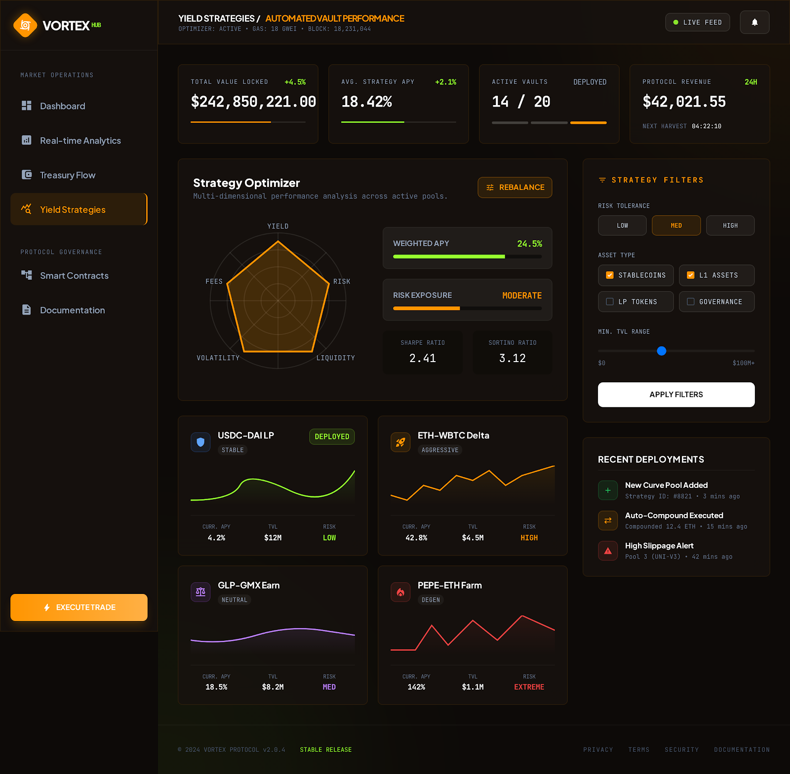

# Treasury Overview

<figure><figcaption><p>Treasury Dashboard — Fund Allocation & Yield Tracking</p></figcaption></figure>


## Purpose

The VORTEX Treasury is the financial backbone of the protocol. It serves three critical functions:

1. **Yield Generation** — Deploy capital into battle-tested DeFi protocols to generate sustainable returns
2. **Ecosystem Funding** — Fund Mystery Crate USDC rewards, Drought Bonuses, and operational costs
3. **Emergency Reserve** — Maintain a safety buffer for unexpected events or market downturns

## Treasury Composition

| Asset | Source | Purpose |
| --- | --- | --- |
| **USDC** | 5% of vortex distribution + raffle pass revenue overflow | Primary yield-generating asset |
| **VORTEX** | 15% of total supply (vested) | Protocol-owned tokens for strategic use |
| **LP Tokens** | Protocol-owned liquidity | Permanent liquidity floor |
| **DeFi Positions** | Deployed treasury capital | Yield generation |

## Treasury Management

### Multi-Sig Security

The treasury is controlled by a **3-of-5 multi-signature wallet**:

- No single person can move funds
- All transactions require multiple signers
- Signer addresses are publicly known
- Transaction history is fully transparent on-chain

### Allocation Strategy

Treasury capital is deployed according to a risk-tiered strategy:

```
Treasury Capital
    │
    ├── 50% → Low Risk (Stablecoin lending)
    │         Aave, Compound, Morpho
    │         Target: 3-8% APY
    │
    ├── 30% → Medium Risk (LP positions)
    │         Blue-chip pairs on major DEXs
    │         Target: 8-15% APY
    │
    ├── 10% → Higher Yield (RWA protocols)
    │         Centrifuge, Maple Finance
    │         Target: 10-20% APY
    │
    └── 10% → Reserve (Idle USDC)
              Emergency buffer
              No yield target
```

### Yield Distribution

All yield generated by the treasury is distributed as follows:

| Allocation | Percentage | Purpose |
| --- | --- | --- |
| **Mystery Crate USDC Rewards** | 40% | Funds the Legendary-tier crate payouts |
| **Hype Vault** | 25% | Marketing and growth fund (see [Hype Vault](hype-vault.md)) |
| **Drought Bonuses** | 20% | Vortex top-ups during low volume |
| **Operational Costs** | 10% | Infrastructure, audits, development |
| **Reserve Growth** | 5% | Compounds the emergency reserve |

## Transparency

### On-Chain Verification

- All treasury wallet addresses are **publicly listed**
- DeFi positions are verifiable on-chain via block explorers
- A **Treasury Dashboard** on the VORTEX website shows:
  - Current total treasury value
  - Breakdown by asset and protocol
  - Historical yield performance
  - Upcoming distributions

### Monthly Treasury Reports

The team publishes a **monthly treasury report** including:
- Total assets under management
- Yield generated and distributed
- Protocol allocation changes
- Risk assessment updates
- Upcoming strategy adjustments

## Treasury Growth Flywheel

```
Trading Volume → Tax Revenue → Vortex Grows
                                    │
                              5% to Treasury
                                    │
                              Treasury Deploys
                                    │
                              Yield Generated
                                    │
                    ┌───────────────┼───────────────┐
                    │               │               │
              Crate Rewards    Hype Vault    Drought Bonus
                    │               │               │
              User Engagement  New Users     Bigger Vortex
                    │               │               │
                    └───────────────┼───────────────┘
                                    │
                              More Volume
                                    │
                              More Tax Revenue
                                    │
                              Treasury Grows ↻
```

> The treasury creates a **self-reinforcing growth loop** where yield funds engagement, engagement drives volume, and volume grows the treasury.
